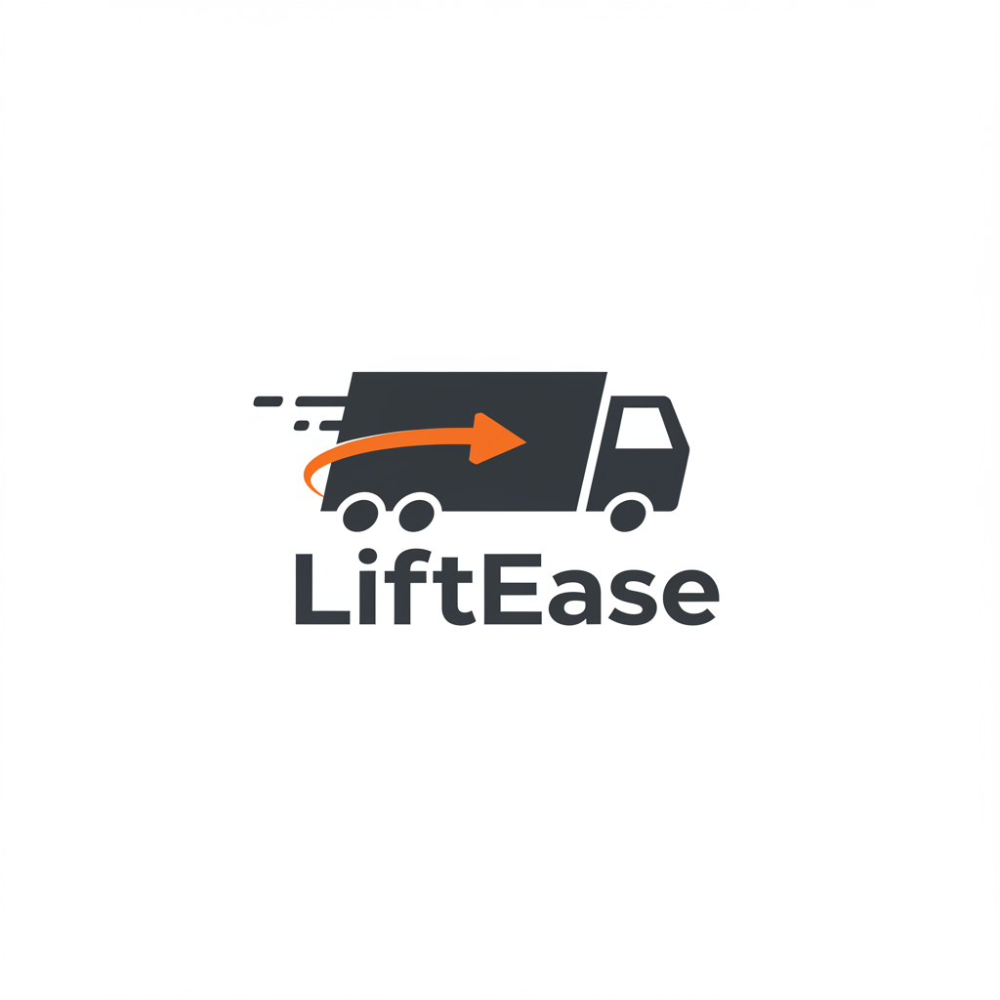

# LiftEase: Intelligent Freight Logistics Optimization

<table>
  <tr>
    <td width="128">
      <!-- Ensure the logo path is correct relative to the .github/profile/README.md file -->
       
    </td>
    <td>
      <strong>LiftEase is a research-driven initiative focused on revolutionizing the freight transportation sector through advanced digital solutions and optimization algorithms. Our platform aims to enhance efficiency, reduce operational costs, and promote environmental sustainability within the logistics industry.</strong>
        
      <!-- Technology Badges -->
      

        
        
        
        
        
        
        
        
        
        
        
        
        
      

       
       <!-- Funding Badge -->
      

        
      

    </td>
  </tr>
</table>

## Overview

LiftEase represents a comprehensive ecosystem designed to address critical inefficiencies prevalent in traditional freight transportation. By integrating real-time data analytics, sophisticated route optimization (leveraging tools like OSRM), and a user-centric mobile application, we provide carriers with the tools necessary to minimize empty return trips ("deadheading"), optimize fuel consumption, and maximize profitability. Our platform facilitates seamless job discovery, route planning, and operational management for transport professionals.

## Project Significance & Motivation

The conventional logistics landscape often suffers from significant inefficiencies, most notably the high percentage of vehicles returning empty after a delivery. This practice incurs substantial economic losses for carriers and contributes significantly to unnecessary fuel consumption and carbon emissions.

LiftEase tackles this challenge head-on by:

*   **Digitizing Job Discovery:** Creating a dynamic marketplace connecting shippers with available carriers in real-time.
*   **Optimizing Routes:** Employing advanced algorithms to calculate the most efficient routes, considering factors like distance, time, cost, and potential backhaul opportunities.
*   **Reducing Empty Miles:** Intelligently matching return trip loads with drivers based on their location and destination, drastically reducing unprofitable journeys.
*   **Enhancing Sustainability:** Lowering the environmental footprint of freight transport through optimized fuel usage and reduced mileage.

**This project is proudly supported by the Scientific and Technological Research Council of Turkey (TÜBİTAK) under the 2209-A University Students Research Projects Support Program (2025 - 1st Term), recognizing its potential for innovation and impact.**

## System Architecture

LiftEase is architected using a **microservices** approach to ensure scalability, resilience, and maintainability. Key components communicate asynchronously via an **event-driven** model facilitated by **RabbitMQ**. This design allows for independent development, deployment, and scaling of individual services.

Core architectural principles include:

*   **Domain-Driven Design (DDD):** Structuring services around specific business capabilities (e.g., User Management, Load Management, Routing, Payments).
*   **Command Query Responsibility Segregation (CQRS):** Utilized within specific services (like the Route service) to optimize read and write operations.
*   **SAGA Pattern:** Employed for managing distributed transactions across multiple services to maintain data consistency in complex workflows (e.g., job assignment and payment initiation).

## Core Components

The LiftEase ecosystem primarily consists of:

1.  **Backend Platform (`liftease-backend` - *Conceptual*)**: A collection of microservices handling the core business logic:
    *   **User Service:** Manages user identity, authentication (Firebase Auth), profiles, and roles. (Tech: Python, FastAPI, MongoDB)
    *   **Load Service:** Handles creation, management, and assignment of freight loads and jobs. (Tech: .NET 8, C#, PostgreSQL)
    *   **Route Service:** Manages route information, integrates with optimization engines (OSRM), and applies CQRS patterns. (Tech: .NET, C#)
    *   **Payment Service:** Orchestrates financial transactions and tracks payment statuses (Under Development).
    *   **Route Optimization Service:** Contains the core algorithms for optimizing routes based on various constraints (potentially integrating OSRM). (Tech: Python/C# depending on implementation)

2.  **Mobile Application (`liftease-mobile`)**: A cross-platform application built with React Native (Expo) serving as the primary interface for truck drivers. It offers features like:
    *   Job discovery and acceptance.
    *   Turn-by-turn navigation integration.
    *   Real-time job status updates.
    *   Earnings tracking and document management.
    *   [Link to LiftEase Mobile Repository - *Replace with actual link if public*](https://github.com/liftease/liftease-mobile)

## Technology Stack

LiftEase leverages a modern and robust technology stack:

*   **Backend:** .NET 8, C#, Python 3, FastAPI
*   **Frontend (Mobile):** React Native, TypeScript, Expo
*   **Databases:** PostgreSQL, MongoDB
*   **Authentication:** Firebase Authentication
*   **Messaging Broker:** RabbitMQ
*   **Routing Engine:** Open Source Routing Machine (OSRM)
*   **Containerization:** Docker, Docker Compose
*   **State Management (Mobile):** Zustand
*   **API Communication:** Axios (Mobile), Standard HTTP Clients (Backend)

## Team & Acknowledgements

LiftEase is developed by a dedicated team of students from Akdeniz University:

*   **Ali Kağan Yılmaz**
*   **Yusuf Samed Çelik**
*   **Erencan Yıldırım**

**Academic Advisor:**
*   Murat Ak (Akdeniz Üniversitesi)

We extend our sincere gratitude to **TÜBİTAK** for their invaluable financial support through the 2209-A program, which has been instrumental in the realization of this project.

## Academic Context & Contribution

This project originates from university-level research aimed at applying cutting-edge software engineering principles and operations research techniques to solve real-world logistics problems. Our contributions include:

*   The practical application of microservices, DDD, and event-driven architecture in the complex domain of freight logistics.
*   Development of a system designed to yield measurable improvements in operational efficiency and sustainability for carriers.
*   Providing a platform with the potential for further academic research in areas such as dynamic optimization algorithms, predictive analytics for load availability, and behavioral economics in driver job selection.
*   Expected outputs include potential conference papers, journal articles, and graduation theses based on the project's findings and technological developments.

## License

This project is licensed under the MIT License - see the `LICENSE` file for details. (Note: You'll need to add a LICENSE file to your repositories).

---

&copy; 2025 LiftEase Team - Akdeniz Üniversitesi
